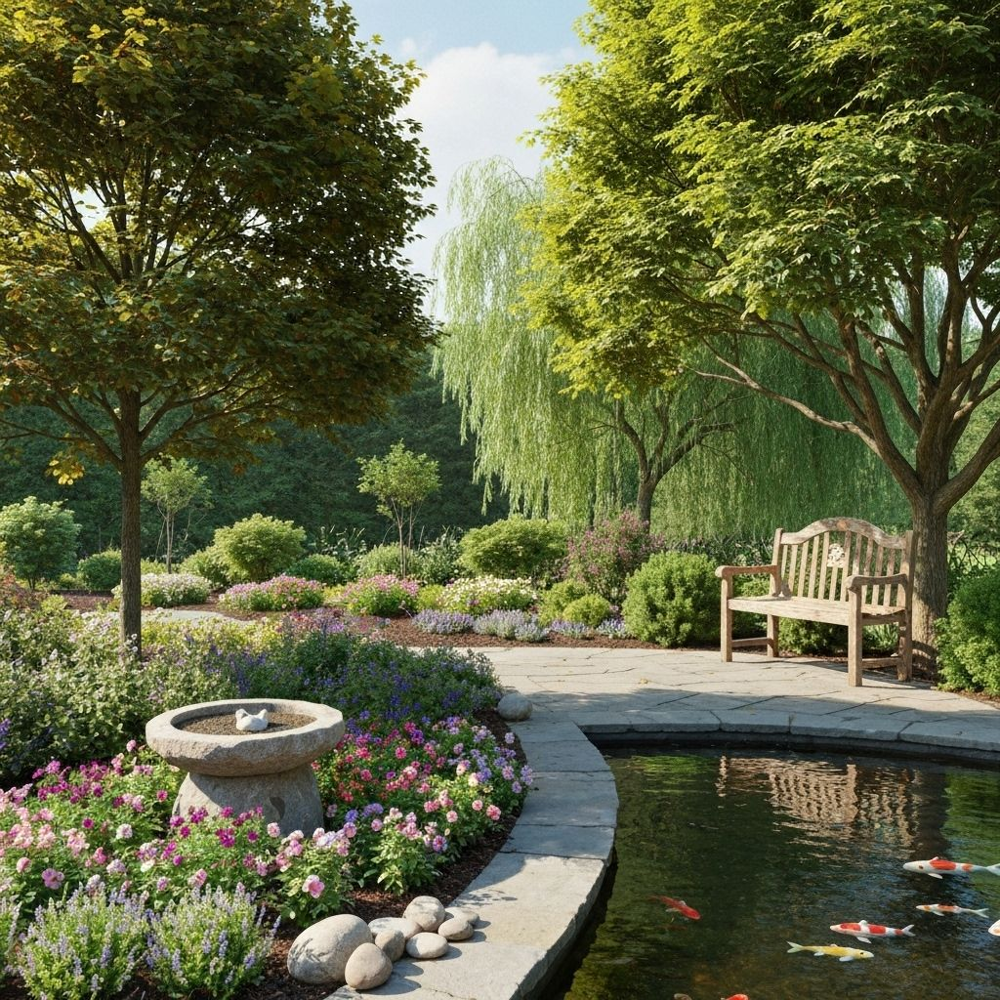
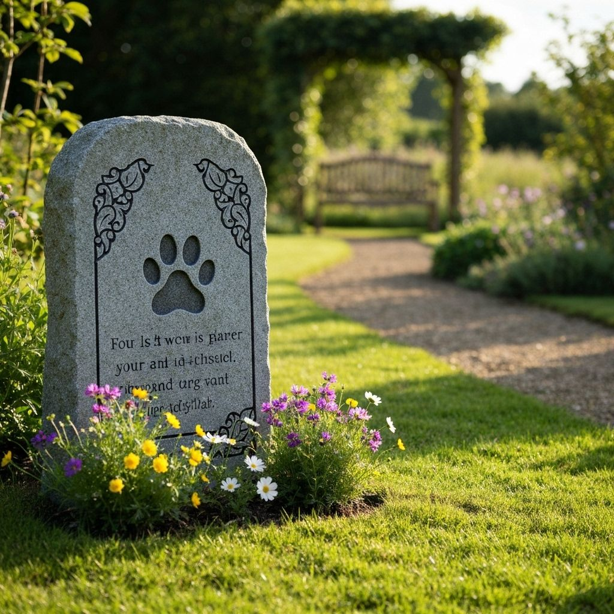
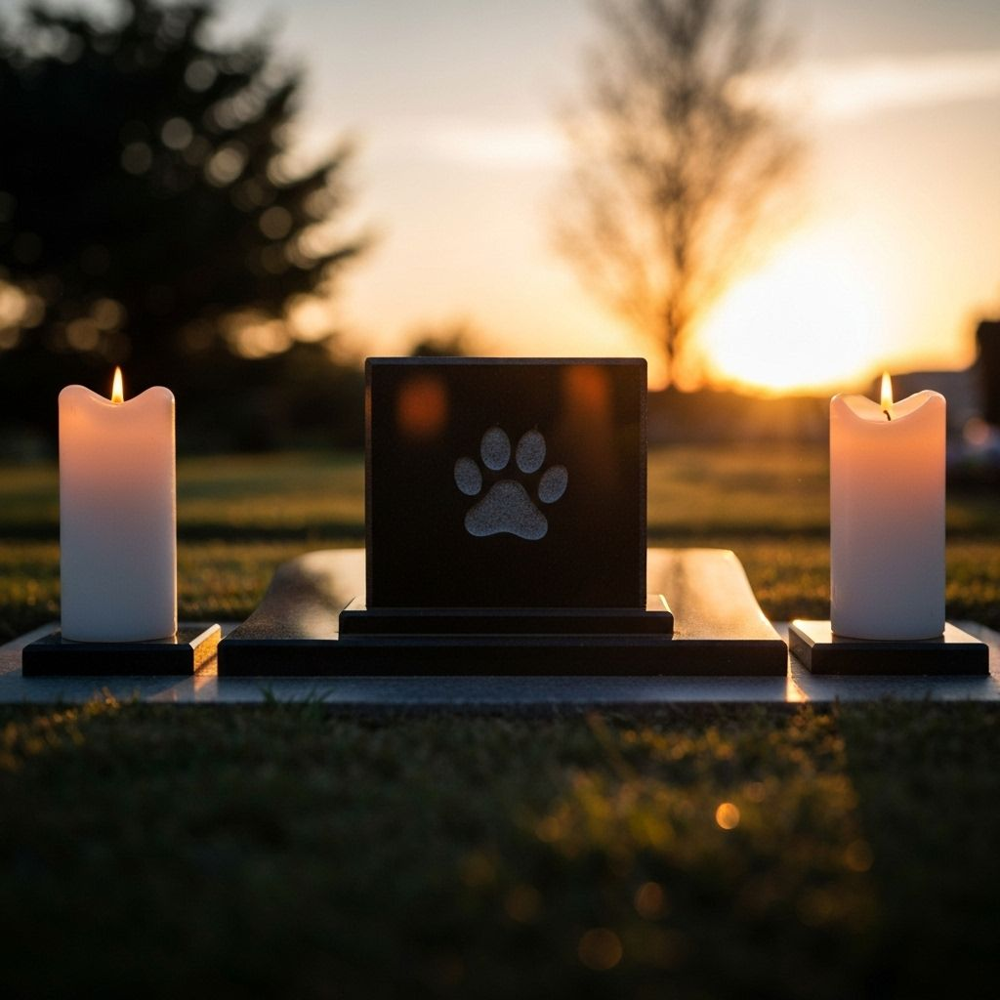
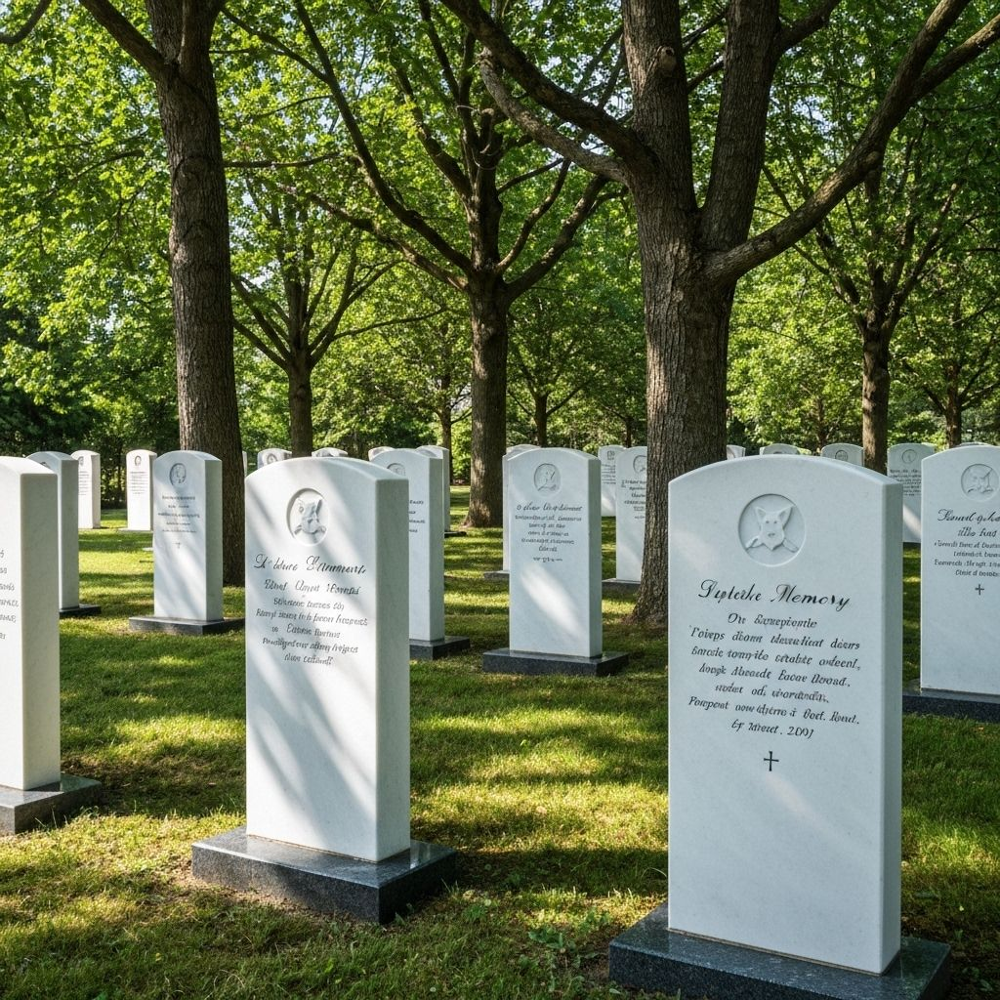
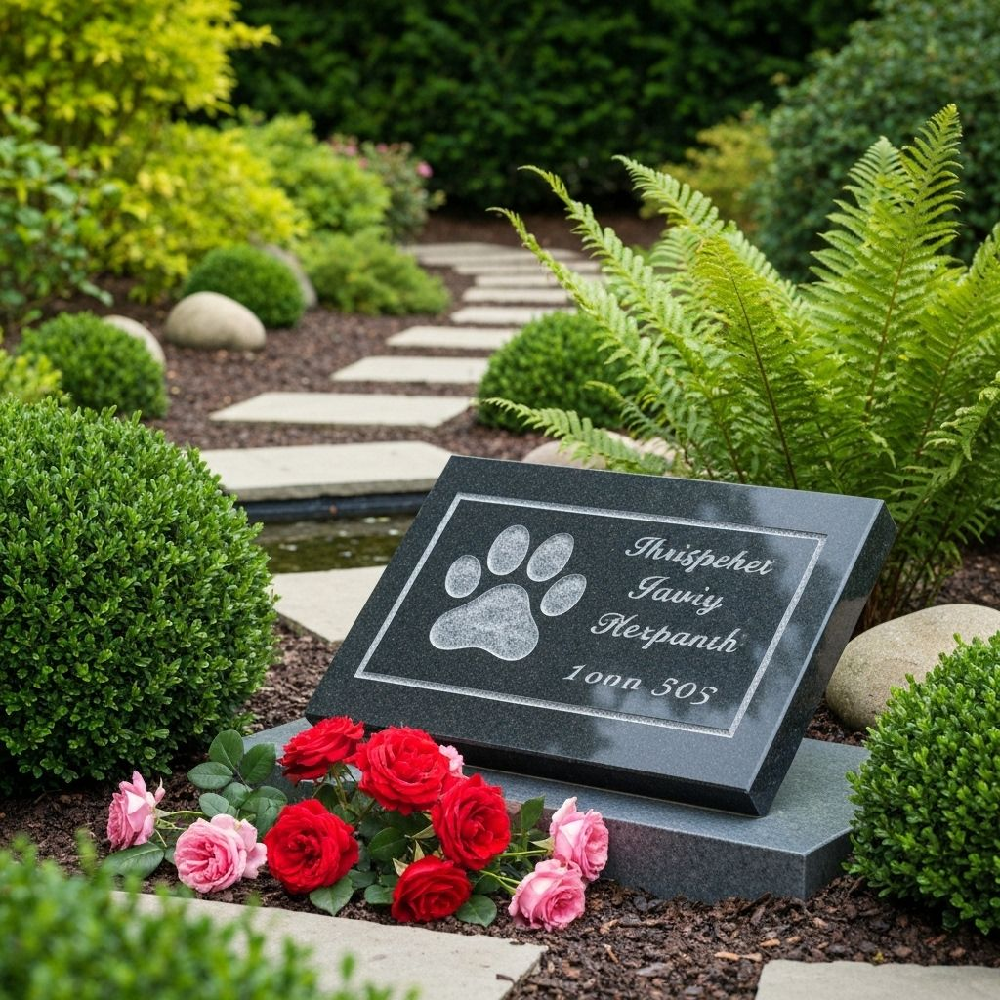
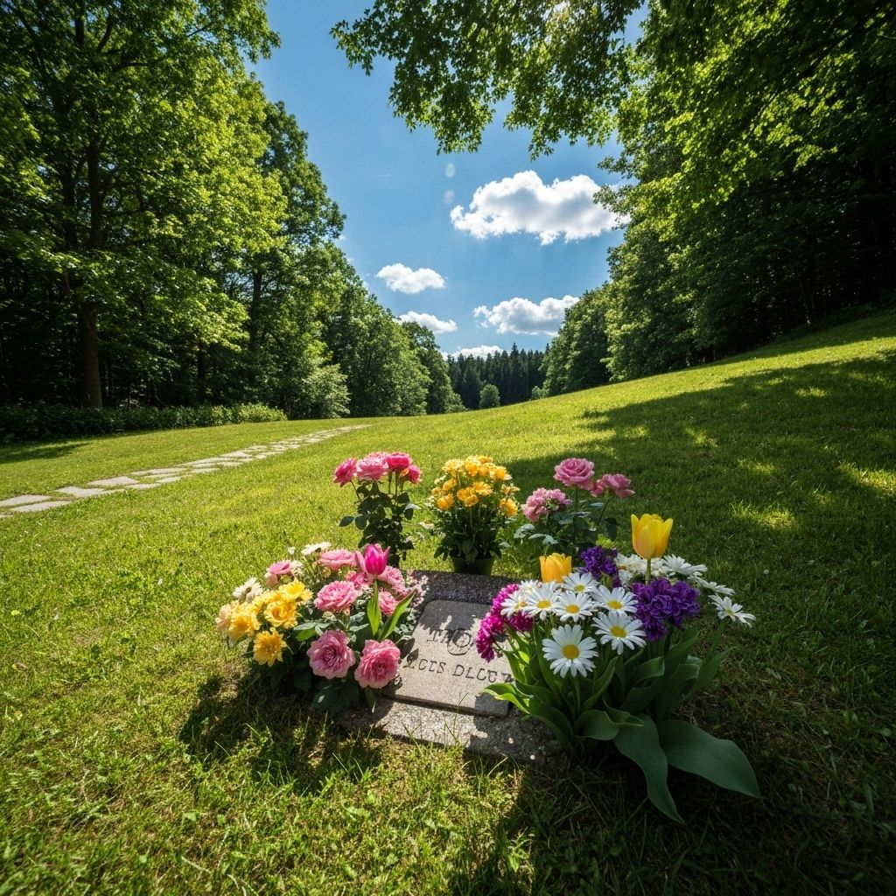
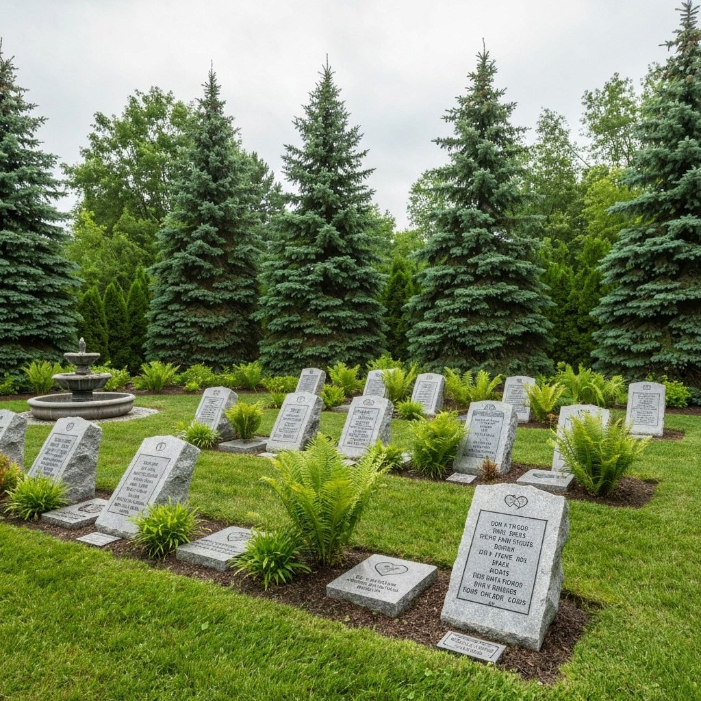
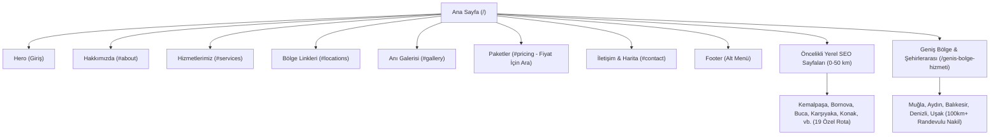

# 🐾 Ege Pet Hayvan Mezarlığı — Kapsamlı Site Yapısı ve İçerik Haritası

Bu doküman, **Ege Pet Hayvan Mezarlığı** web sitesinin tüm sayfa mimarisini, bileşenlerini, metin içeriklerini, defin paketlerini, bölgesel SEO sayfalarını ve sitede kullanılan gerçek müşteri görsellerini eksiksiz bir şekilde içermektedir.

---

## 📌 1. Genel Bilgiler & İletişim

* **Resmi İşletme Adı:** Ege Pet Hayvan Mezarlığı
* **Web Sitesi:** [egepetmezarligi.com](https://egepetmezarligi.com)
* **Fiziki Tesis & Kabristan:** Kemalpaşa Huzur Bahçesi (Dereköy Mah., Kemalpaşa / İzmir - 2 Dönümlük Doğal Alan)
* **Yetkili / İletişim:** Murat Yılmaz
* **Telefon:** [+90 546 735 31 62](tel:+905467353162) (7/24 Cenaze Nakil ve Defin)
* **WhatsApp:** [wa.me/905467353162](https://wa.me/905467353162)
* **E-posta:** murat-35-10@hotmail.com
* **Sosyal Medya:** Instagram: `@egepet_izmir`
* **Geliştirici:** [BayhanTech (bayhan.tech)](https://bayhan.tech)

---

## 🖼️ 2. Gerçek Müşteri Anıları & Görseller

| Görsel Adı | Açıklama | Görsel Önizleme / Dosya Yolu |
| :--- | :--- | :--- |
| **Site Ana Logosu** | Header & Footer'da kullanılan resmi Ege Pet logosu |  |
| **Hero Arka Planı** | Ana sayfa girişindeki atmosferik anı bahçesi |  |
| **Huzur Bahçesi Görseli** | Hakkımızda bölümü doğa ve bahçe fotoğrafı |  |
| **Anı Taşı (Luna)** | Çiçekli doğal anı taşı |  |
| **Anı Taşı (Milo)** | Gün batımında mumlarla anı köşesi |  |
| **Anı Taşı (Bella)** | Beyaz mermer taşlar ve doğal peyzaj |  |
| **Anı Taşı (Max)** | Gül ve çiçeklerle süslenmiş anı plaketi |  |
| **Anı Taşı (Charlie)** | Çiçeklerle çevrili doğal defin alanı |  |
| **Anı Taşı (Daisy)** | Huzurlu anı bahçesi işaretçileri |  |
| **Geliştirici Logosu** | BayhanTech dijital imza logosu |  |

---

## 🗺️ 3. Site Mimarisi ve Rota Yapısı

---

## 📄 4. Sayfa ve Bölüm İçerikleri

### 4.1. Üst Menü (Navigation)
* **Marka:** Ege Pet Hayvan Mezarlığı
* **Menü:** Ana Sayfa, Hakkımızda, Hizmetlerimiz, Anı Galerisi, Paketler, İletişim
* **Dil Seçimi:** Türkçe (`🇹🇷 TR`) / İngilizce (`🇬🇧 EN`)

---

### 4.2. Hero (Giriş Bölümü)
* **Giriş Animasyonu:** Sıralı, hafif gecikmeli (Badge -> Başlık -> Alt Başlık -> Butonlar -> Kartlar) akıcı geçiş.
* **Ana Başlık:** *"Sadık dostlarınıza ebedi ve huzurlu bir veda…"*
* **Alt Başlık:** *"Yıllarca hayatınızı paylaşan can dostunuz için İzmir Kemalpaşa'da, doğanın kucağında saygılı ve kalıcı bir ebedi istirahat alanı."*

---

### 4.3. Hizmet Paketlerimiz (#pricing)
*Sitede hiçbir tutar (₺) yazmaz. Bilgi ve randevu için doğrudan 0546 735 31 62 aranır.*

1. **Temel Paket:**
   - Evden veya klinikten alım hizmeti
   - Kemalpaşa kabristanına nakil ve defin işlemi
   - Standart anı taşı ve işaretçi
   - Resmi anı sertifikası
   - **Aksiyon:** `[ Fiyat İçin Ara (0546 735 31 62) ]`

2. **Özel Paket (Popüler):**
   - Evden veya klinikten alım hizmeti
   - Kemalpaşa kabristanına nakil ve defin işlemi
   - Premium anı taşı ve mermer düzenlemesi
   - Huzur Bahçesi'nde özel tahsis edilmiş alan
   - Fotoğraflı anı plaketi
   - Resmi anı sertifikası
   - **Aksiyon:** `[ Fiyat İçin Ara (0546 735 31 62) ]`

3. **Premium Paket:**
   - Öncelikli 7/24 evden / klinikten nakil hizmeti
   - Kemalpaşa kabristanında özel defin işlemi
   - Huzur Bahçesi'nde VIP özel anı alanı
   - Fotoğraflı anı plaketi ve mermer mezar taşı
   - Özel veda merasimi & anı sertifikası
   - Profesyonel fotoğraf ve video çekimi
   - **Aksiyon:** `[ Fiyat İçin Ara (0546 735 31 62) ]`

---

### 4.4. Anı Galerisi (Tekilleştirilmiş Gerçek Müşteri Anıları)
Gerçek müşteri mezar taşları ve anı alanları tekilleştirilmiş, hover detaylı ve clip-path geçişli olarak listelenir.
